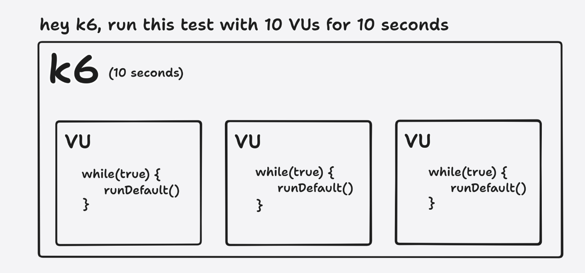
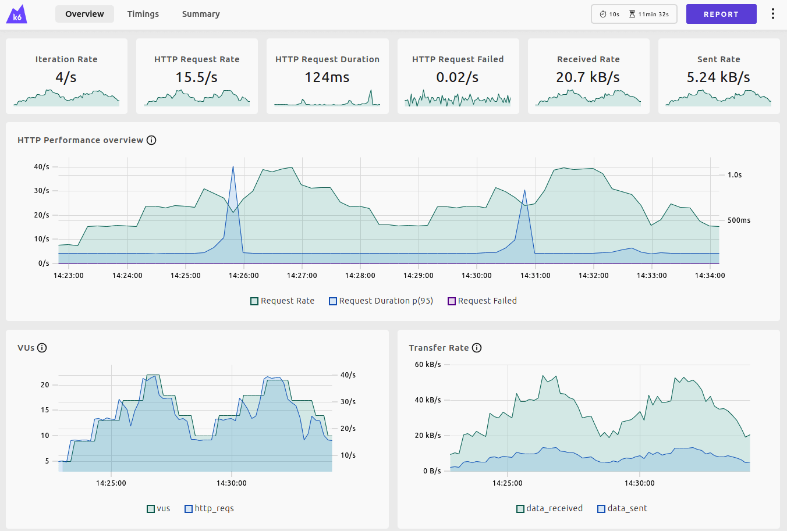
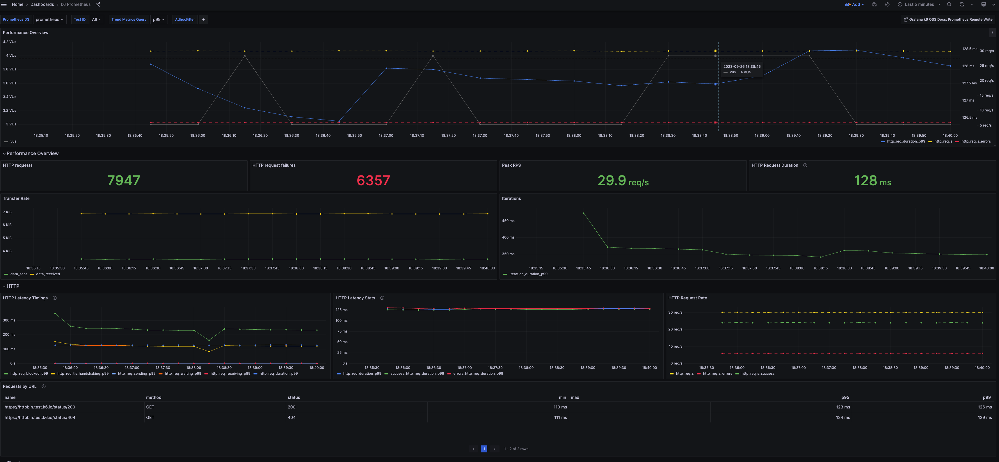
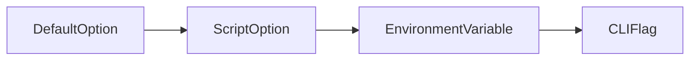
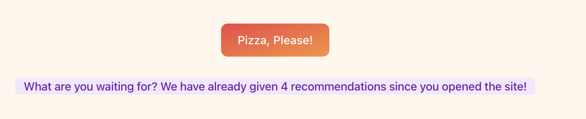

# k6 OSS Workshop

A 2-3 hour k6 workshop with practical k6 examples using the QuickPizza demo app. 

This workshop is intented to be used as a starting point for anyone who wants to learn or teach k6 to others. 

You are encouraged to copy and modify the workshop for your particular case or audience. If you need some slides, check out the [k6 starter deck](https://docs.google.com/presentation/d/1gviRg7RTzT0Y2_5WPBADyn5xpa96PIqWivGAThNW6pM/edit?usp=sharing).

**Table of contents**

You can view the table of contents clicking the menu icon  at the top left of this readme page. 

- [Before we start](#before-we-start)
  * [Requirements](#requirements)
  * [Run the playground](#run-the-playground)
- [Fundamentals](#fundamentals)
  * [What is load (performance) testing](#what-is-load-performance-testing)
  * [Run your first k6 test](#run-your-first-k6-test)
  * [Model the test load (workload)](#model-the-test-load-workload)
  * [`vus` and `iterations`](#vus-and-iterations)
  * [`vus` and `duration`](#vus-and-duration)
  * [`stages`](#stages)
  * [`scenarios`](#scenarios)
  * [Think time](#think-time)
- [Define Pass/Fail criteria](#define-passfail-criteria)
  * [Checks](#checks)
  * [Thresholds](#thresholds)
- [Performance test results](#performance-test-results)
  * [Custom summary](#custom-summary)
  * [Web dashboard](#web-dashboard)
  * [Visualize results with Prometheus and Grafana](#visualize-results-with-prometheus-and-grafana)
- [More examples](#more-examples)
  * [CLI overrides and environment variables](#cli-overrides-and-environment-variables)
  * [Test lifecycle hooks](#test-lifecycle-hooks)
  * [Test data parameterization](#test-data-parameterization)
  * [Custom metrics](#custom-metrics)
  * [WebSockets](#websockets)
  * [Browser testing](#browser-testing)
  * [Additional resources](#additional-resources)

## Before we start

### Requirements

- Docker & Docker Compose
- git
- k6 
	- (Recommended) [Install the k6 binary for your OS](https://grafana.com/docs/k6/latest/get-started/installation/). You can easily remove the k6 binary afterward if you don't want it.
	- Alternatively, you can also run k6 inside Docker. 
		- However, the experience using the k6 binary is better as it requires fewer commands and the results in the terminal are nicer. 
		- If you plan to run k6 with Docker, pre-pull the k6 images:
			- `docker pull grafana/k6`
			- `docker pull grafana/k6:latest-with-browser`


### Run the playground

First of all, clone the repository:

```bash
git clone https://github.com/grafana/k6-oss-workshop.git
```

Then, go to the project directory and run the playground environment with Docker compose:

```bash
cd k6-oss-workshop && docker compose up -d
```


To verify everything is working, go to http://localhost:3333 and click the big button to get a Pizza recommendation!

And, open http://localhost:3000 and verify that you can see a Grafana instance.


## Fundamentals

### What is load (performance) testing

Performance testing is known as the testing practice that verifies how our system behaves and performs, often regarding speed and reliability. Performance testing and load testing often refer to the same practice.

Before writing our first test, let's briefly cover the load testing fundamentals:

- What is load testing
- Types of load tests
- Usual goals

### Run your first k6 test

To run your first test, we'll use the [`test.js`](./test.js) file in this repo:

```js
import http from "k6/http";

const BASE_URL = __ENV.BASE_URL || "http://localhost:3333";

export default function () {
  let restrictions = {
    maxCaloriesPerSlice: 500,
    mustBeVegetarian: false,
    excludedIngredients: ["pepperoni"],
    excludedTools: ["knife"],
    maxNumberOfToppings: 6,
    minNumberOfToppings: 2,
  };
  let res = http.post(`${BASE_URL}/api/pizza`, JSON.stringify(restrictions), {
    headers: {
      "Content-Type": "application/json",
      "X-User-ID": 23423,
    },
  });
  console.log(`${res.json().pizza.name} (${res.json().pizza.ingredients.length} ingredients)`);
}
```

Then, run it with:

```bash
k6 run test.js
```

<details>
<summary>Docker run</summary>

```bash
docker run -i --network=default_network grafana/k6:latest run -e BASE_URL=http://quickpizza:3333  - <test.js
```

</details>

<br/>

That's it! You have successfully run your first test.

Now, you have a lot of things in the output. Let's go through them.
k6's output has three main sections:
1. Information about the test and its configuration
2. Runtime information (e.g., logs, debug)
3. Summary of the test result

Knowing k6's output is essential, as you will be using it a lot.
In the output's second section, you should see a log line with the pizza name and the number of ingredients. This happens once because k6 has run your default function once.

```bash
INFO[0000] A Pink Americana (7 ingredients)              source=console
```

You can also see in the third section lots of metrics that k6 has generated and aggregated for you. These metrics are helpful to understand how the test went (e.g., the number of requests, errors, response time, etc.), also known as built-in k6 metrics. 

```bash
data_received..................: 745 B 2.9 kB/s
data_sent......................: 323 B 1.3 kB/s
http_req_blocked...............: avg=5.21ms   min=5.21ms   med=5.21ms   max=5.21ms   p(90)=5.21ms   p(95)=5.21ms  
http_req_connecting............: avg=1.52ms   min=1.52ms   med=1.52ms   max=1.52ms   p(90)=1.52ms   p(95)=1.52ms  
http_req_duration..............: avg=238.21ms min=238.21ms med=238.21ms max=238.21ms p(90)=238.21ms p(95)=238.21ms
{ expected_response:true }...: avg=238.21ms min=238.21ms med=238.21ms max=238.21ms p(90)=238.21ms p(95)=238.21ms
http_req_failed................: 0.00% ✓ 0       ✗ 1
http_req_receiving.............: avg=5.86ms   min=5.86ms   med=5.86ms   max=5.86ms   p(90)=5.86ms   p(95)=5.86ms  
http_req_sending...............: avg=3.74ms   min=3.74ms   med=3.74ms   max=3.74ms   p(90)=3.74ms   p(95)=3.74ms  
http_req_tls_handshaking.......: avg=0s       min=0s       med=0s       max=0s       p(90)=0s       p(95)=0s      
http_req_waiting...............: avg=228.6ms  min=228.6ms  med=228.6ms  max=228.6ms  p(90)=228.6ms  p(95)=228.6ms 
http_reqs......................: 1     3.90657/s
iteration_duration.............: avg=250.42ms min=250.42ms med=250.42ms max=250.42ms p(90)=250.42ms p(95)=250.42ms
iterations.....................: 1     3.90657/s
```

Some of the most important metrics are:
- `http_reqs`, to measure the number of requests (request rate).
- `http_req_failed`, to measure the error rate (errors).
- `http_req_duration`, to measure response times (latency).
- `vus`, to measure the number of virtual users (traffic).

You can learn more about these metrics in the [built-in k6 metrics documentation](https://grafana.com/docs/k6/latest/using-k6/metrics/reference/), and find other metrics such as gRPC, WebSocket, or Browser metrics. These metrics will be reported when using their respective [k6 APIs](https://grafana.com/docs/k6/latest/javascript-api/) in our test. 

### Model the test load (workload)

Two concepts are key to understanding how to model the load in k6: Virtual Users (VUs) and iterations. 

1. An iteration is a single execution of your script. In the example above, it's a single run of your default function.

2. A virtual user is a thread that runs your script for a specific period or number of iterations. 

You can think of it like a for-loop. You can have many VUs; each one will be continuously running your script function. 



Basically, k6 acts as a scheduler of VUs and iterations based on the test load configuration.

When you run a k6 test, by default, it will run your script once, with a single VU. This is useful for debugging your script. However, it's not very useful for understanding how your system behaves under load for some time. To set the test load, k6 provides multiple options:

### `vus` and `iterations`

[`vus`](https://grafana.com/docs/k6/latest/using-k6/k6-options/reference/#vus) and [`iterations`](https://grafana.com/docs/k6/latest/using-k6/k6-options/reference/#iterations) - Specifying the number of virtual users and total number of executions of the default function.

Let's try it out! After the imports, add a configuration block to your script:

```js
export const options = {
  iterations: 30, // the total number of executions of the default function
  vus: 10, // 10 virtual users 
};
```

Run the test again. 

k6 schedules 10 virtual users and runs 30 iterations in total (between all VUs).  After the test finishes, find these results in the `iterations` and `vus` metric output. 

### `vus` and `duration`

[`vus`](https://grafana.com/docs/k6/latest/using-k6/k6-options/reference/#vus) and [`duration`](https://grafana.com/docs/k6/latest/using-k6/k6-options/reference/#duration) - Specifying the number of virtual users and the total test duration.

```js
export const options = {
  vus: 10, // virtual users
  duration: '10s', // total test duration
};
```

Replace the options settings in the previous script and run the test again.

k6 schedules 10 virtual users that execute the default function continuously for 10 seconds.


### `stages`

[`stages`](https://grafana.com/docs/k6/latest/using-k6/k6-options/reference/#stages) - Specifying a list of periods that must reach a specific VU target.

```js
export const options = {
  stages: [
    // ramp up from 0 to 20 VUs over the next 5 seconds
    { duration: '5s', target: 20 },
    // run 20 VUs over the next 10 seconds
    { duration: '10s', target: 20 },
    // ramp down from 20 to 0 VUs over the next 5 seconds
    { duration: '5s', target: 0 },
  ],
};
```

Replace the options settings in the previous script and run the test again.
What's k6 doing?
1. During the first 5 seconds, k6 will ramp up from 0 to 20 VUs.
2. Then, it will stay at 20 VUs for 10 seconds.
3. Finally, it will ramp down from 20 to 0 VUs in 5 seconds.

<details>
<summary>Docker run</summary>

> The output will be messy if you use Docker to run this test. You can fix that by adding the [--quiet flag](https://grafana.com/docs/k6/latest/using-k6/k6-options/reference/#quiet) to the k6 command. Why? B/c while using the CLI, you would get a very nice progress bar, telling you how many VUs are running and how your test behaves in real-time. However, when using Docker, k6 will output the progress bar in the logs.

</details>


### `scenarios` 

This workshop won't cover all the different scenario options, so please refer to the [Scenario documentation for further details](https://grafana.com/docs/k6/latest/using-k6/scenarios/). 

The Scenarios API allows modeling the workload for different use cases and execute multiple functions, each with distinct workloads.

In this example, we’ll use scenarios to demo how to set the workload in terms of requests per second, specifically, 20 requests per second for 10 seconds. 

```js
export const options = {
  scenarios: {
    default: {
      executor: 'constant-arrival-rate',

      // How long the test lasts
      duration: '10s',

      // Iterations rate. By default, the `timeUnit` rate is 1s. 
      rate: 20,


      // Required. The value can be the same as the rate.
      // k6 warns during execution if more VUs are needed.
      preAllocatedVUs: 20,
    },
  },
};
```

Replace the options settings in the previous script. 

This setting uses the [`constant-arrival-rate` scenario](https://grafana.com/docs/k6/latest/using-k6/scenarios/executors/constant-arrival-rate/) to schedule a rate of iterations, telling k6 to schedule the execution of **20 iterations** (`rate`: 20) **per second** (the default `timeUnit`).


Given that each iteration executes only one Pizza request, the test will run 20 requests per second. Mathematically speaking:
- 20 iterations per second x 1 request per iteration = 20 requests per second 
- 20 requests per second x 20 second = 200 requests

Run the test. After completion, you can see the test request rate by looking at the `http_reqs` metric, which reports the number of http requests and the request rate. In our example, it is close to our goal of 20 requests per second.

```bash
http_reqs......................: 201    19.680544/s
```

### Think time

We are hammering the service a bit too much as there is no wait/think time between iterations. Let's add sleep to be a bit more gentle.

Add this import at the top of the file:

```js
import { sleep } from 'k6';
```

Replace the scenario workload with `stages` or `vus/duration`.

```js
export const options = {
  vus: 10,
  duration: '10s',
};
```

Finally, add this line at the end of the default function to pause the VU execution for 1 second:

```js
sleep(1);
```

Then, rerun the script.

Now, we are getting a pizza recommendation every second. That is more realistic! 


You can use think time ([`sleep`](https://grafana.com/docs/k6/latest/javascript-api/k6/sleep/)) to accurately simulate end users' behavior, making a load testing script more realistic. You should consider adding think time if:
- Your test follows a user flow, like accessing different parts of the application in a certain order.
- You want to simulate actions that take some time to carry out, like reading text on a page or filling out a form.

Note that using think time ([`sleep`](https://grafana.com/docs/k6/latest/javascript-api/k6/sleep/)) reduces how quickly requests are sent. Think time is unnecessary when:
- You want to do a stress test to find out how many requests per second your application can handle.
- The API endpoint you're testing experiences a high amount of requests per second in production that occur without delays.

## Define Pass/Fail criteria

Another problem with our script is that we don't validate whether the service is working as expected. We are just blindly sending requests and hoping for the best. Then, we should include assertions in our test to verify the behavior or performance of the responses.

In testing, an assertion typically refers to verifying a particular condition in the test: Is this true or false? For most testing tools, if an assertion evaluates as false, the test fails.

k6 works slightly differently in this regard, having two different APIs for defining assertions:
- **Thresholds**: used to establish the Pass/Fail criteria of the test.
- **Checks**: used to create assertions and inform about their status without affecting the Pass/Fail outcome.

### Checks

Checks are like assertions—they verify whether a condition is met. Checks inform about the assertion result; however, they do not affect the Pass/Fail test result.

But why does a check failure not fail the test? It’s a design choice. Production systems typically don’t aim for 100% reliability; instead, we define error budgets and 'nines of availability,' – our systems often accept a certain percentage of errors.

Let's see them in action by adding a check to validate that the status of the HTTP response is 200.

First, we need to import the check function:

```js
import { check } from "k6";
```

Then, we can add a check to our script. You just need to add the following lines after the request:

```js
check(res, {
  "is status 200": (r) => r.status === 200,
});
```

Then, rerun the script.

Now, you should see a new section in the output with the results of the checks! You should see that all the checks have passed. That's good!

If you want to see what happens when a check fails, you can change the check to:

```js
check(res, {
  "is status 200": (r) => r.status === 500,
});
```

For more information, refer to the [Checks documentation](https://grafana.com/docs/k6/latest/using-k6/checks/).


### Thresholds

Thresholds are the pass/fail criteria you define for your test metrics. If the system under test (SUT) does not meet the conditions of your threshold, the test finishes with a failed status. That means that k6 will exit with a non-zero exit code. You can leverage standard metrics that k6 generates or custom metrics that you define in your script.


Let's add a threshold to our script. You can do that by changing the options block to:

```js
export let options = {
  stages: [
    { duration: "5s", target: 10 },
    { duration: "10s", target: 10 },
    { duration: "5s", target: 0 },
  ],
  thresholds: {
    "http_req_duration": ["p(95)<5000"],
  },
};
```

Then, rerun the script. 

When the test ends, k6 reports the threshold status with a green checkmark ✅ or a red cross ❌ near the metric name.

This threshold is saying that 95% of the requests should be faster than 5 seconds ✅. If that's not the case, the threshold fails ❌.

To see what happens when a threshold fails, you can change the threshold to:

```js
export let options = {
  stages: [
    { duration: "5s", target: 10 },
    { duration: "10s", target: 10 },
    { duration: "5s", target: 0 },
  ],
  thresholds: {
    "http_req_duration": ["p(95)<10"],
  },
};
```

You can also inspect the status code of the test with:

```bash
echo $?
```

<details>
<summary>Docker run</summary>

```bash
docker run -i --network=default_network grafana/k6 run -e BASE_URL=http://quickpizza:3333  - <test.js; echo $?
```

</details>

<br/>

Then, rerun the script.

There is also the option to abort the test if a threshold fails using this syntax:

```js
thresholds: {
  "http_req_duration": [
    { threshold: "p(95)<10", abortOnFail: true },
  ],
},
```

This was a simple Threshold example. The Thresholds API allows for more advanced cases like:
- Defining multiple thresholds.
- Implementing thresholds on custom metrics.
- Setting multiple thresholds for the same metric.
- Querying tags in metrics.

For more information, refer to the [Thresholds documentation](https://grafana.com/docs/k6/latest/using-k6/thresholds/).

## Performance test results

### Custom summary

You have already seen the end-of-test summary in your terminal multiple times. You can customize it!

To customize it, you need to implement the `handleSummary` function.

After your test runs, k6 aggregates your metrics into a JavaScript object. The `handleSummary()` function takes this object as an argument (called `data` in the following example).

Now, let's define a `handleSummary()` that creates a JSON file with the default summary object by adding this snippet at the end of your script:

```js
export function handleSummary(data) {
  return {
    'summary.json': JSON.stringify(data), // the default data object
  };
}
```

If you run the test again, you should see a new file named `summary.json` with all the data the summary would have.

<details>
<summary>Docker run</summary>

```bash
docker run -i --network=default_network grafana/k6:latest run -e BASE_URL=http://quickpizza:3333  - <test.js;

# Find the ID of the k6 container that ran
docker container ls -a

# Copy the `summary.json` file to your local machine
docker cp <container_id>:/home/k6/summary.json .

# In MacBook M1/M2, make sure Docker has rosetta installed and virtualization enabled
```
</details>

<br/>

Fundamentally, `handleSummary()` is just a function that can access a data object. As such, you can transform the summary data into any text format: JSON, HTML, console, XML, and so on. You can pipe your custom summary to standard output or standard error, write it to a file, or share it with any remote service.

For more information, refer to the [Custom summary documentation](https://grafana.com/docs/k6/latest/results-output/end-of-test/custom-summary/). 

### Web dashboard

The test result summary is useful; however aggregated results hide a lot of information as they don’t show how the metrics change during the test execution. 

It is more useful to visualize time-series graphs to understand what happened at different stages of the test. To solve this, k6 has different `Outputs`. These let you export your metrics/logs to some other place in real-time.  

Note that you should set a test duration to at least 30 seconds to receive enough data to visualize a graph. Then, enable the web dashboard by setting the `K6_WEB_DASHBOARD` environment variable to `true` when running your test script as follows:

```bash
K6_WEB_DASHBOARD=true k6 run test.js
```

<details>
<summary>Docker run</summary>

```bash
docker run -p 5665:5665 -i --network=default_network grafana/k6:latest run -e BASE_URL=http://quickpizza:3333 -e K6_WEB_DASHBOARD=true  - <test.js 
```

</details>

<br/>

By default, the web dashboard is available at http://127.0.0.1:5665.



To learn about the distinct dashboard options, refer to the [Web dashboard documentation](https://grafana.com/docs/k6/latest/results-output/web-dashboard/).


### Visualize results with Prometheus and Grafana

The web dashboard is nice, but it does not store your test results. k6 has [many outputs](https://grafana.com/docs/k6/latest/results-output/real-time/) to store your test results. You may want to store test results to visualize them at another moment or compare them with the results of other tests. 

One of the most popular outputs is the Prometheus output. This output will export your metrics to a Prometheus instance, so you can use Grafana to visualize the metrics in real time.
The Docker Compose playground already has a Prometheus and Grafana instance running. So, let's use that!
You just need to change how you invoke k6, and add the Prometheus output:

```sh
k6 run --out=experimental-prometheus-rw test.js
```

<details>
<summary>Docker run</summary>

```bash
docker run -i --network=default_network grafana/k6:latest run --out=experimental-prometheus-rw -e BASE_URL=http://quickpizza:3333 -e K6_PROMETHEUS_RW_SERVER_URL=http://prometheus:9090/api/v1/write - <test.js
```

</details>

<br/>

Then, run the script again. After that, open http://localhost:3000.

Then, go to dashboards and click on the k6 dashboard ([this URL should get you there](http://localhost:3000/d/ccbb2351-2ae2-462f-ae0e-f2c893ad1028/k6-prometheus)).



> Why is this feature experimental? Only because it has been added quite recently to k6. But it is already stable and used by lots of people.


Optionally, you can run the test and set the `testid` tag to identify the metrics of specific test runs. `testid` can be any unique string to identify the test run to query the results.

```bash
k6 run --out=experimental-prometheus-rw --tag testid=1 test.js
```

Then, you can filter specific test results in PromQL queries. The previous k6 Grafana dashboard includes a `Test ID` drop-down menu at the top to filter test results by `testid`.

## More examples

In case you have time (now or later), here are some common cases that you can learn and try out. Pick the example(s) you are most interested in.

### CLI overrides and environment variables

Most things you can configure in the options block can also be overridden via the CLI. If you are curious, check out the [full list of k6 options](https://grafana.com/docs/k6/latest/using-k6/k6-options/reference/).


For example, you can override the number of VUs with the `--vus` flag and the duration with the `--duration` flag, or run 1 iteration to quickly debug your script.


```bash
k6 run test.js -i 1
```

Alternatively, you can control the test configuration via environment variables. k6 uses the option from the highest order of preference, as shown on the following diagram:




Let's see how options are overridden. 

First, replace the options with some small values like:

```js
export const options = {
  vus: 2,
  duration: '30s'
};
```

Run the test and check the `vus` and `duration` value in the terminal output. 

Then, try to:

1. Overwrite the `vus` or `duration` options with their respective environment variables. 
2. Overwrite the `vus` or `duration` options with their CLI flags.
3. You can do the same with any other k6 option.


Also, you can use environment variables to pass secrets to your script (e.g., API keys). 

You can pass environment variables to k6 in multiple ways:

```bash
k6 run -e MY_ENV_VAR=123 example.js
# or
MY_ENV_VAR=123 k6 run example.js
```

Then, you can use it in your script with the `__ENV` object:

```js
console.log(__ENV.MY_ENV_VAR);
```

If you noticed, we have been using the BASE_URL environment variable to pass the URL of the QuickPizza service to our script. That's why we can run the same script locally and in Docker without changing anything!


For further information, you can learn about how options work and environment variables in the documentation.


### Test lifecycle hooks

In k6, there are four lifecycle stages.

```js
// 1. init code

export function setup() {
  // 2. setup code
}

export default function (data) {
  // 3. VU code
}

export function teardown(data) {
  // 4. teardown code
}
```

- Code in the `init` context prepares the script, loads files, imports modules, and defines the test lifecycle functions. Required.
- The `setup` function runs, setting up the test environment and generating data. Optional.
- `VU code` runs in the default (or scenario) function, running for as long and as many times as the options define. Required.
- The `teardown` function runs, post-processing data and closing the test environment. Optional.


You can use the lifecycle functions to do things like, not running the test if the service is down! 

You could do something like that by adding the following code to your script:

```js
export function setup() {
  let res = http.get(BASE_URL)
  if (res.status !== 200) {
    throw new Error(`Got unexpected status code ${res.status} when trying to setup. Exiting.`)
  }
}
```

Then, run the test.

Finally, try adding some logging to the `teardown` function and run the test again.

For further information, refer to the [Test lifecycle documentation](https://grafana.com/docs/k6/latest/using-k6/test-lifecycle/).

### Test data parameterization

So far, we have been using some hard-coded data. Let's change that!

We will make the customerID we add to every request dynamic, with data from a JSON file.
To accomplish that, we first need to create a file named `customers.json` with some customer IDs:

```json
{
  "customers": [
    12351,
    12352,
    12353,
    12354,
    12355,
    12356
  ]
}
```

Then, we need to load this data in k6. There are multiple ways to do that, but one of the easiest and most optimal is using our SharedArray library. This library will load the data once and let all the VUs read it.
To use it, we need to import it:

```js
import { SharedArray } from "k6/data";
```

Then, we need to load the data:

```js
// Add this line after the options block, outside of the default function, as we want to load the data only once.
const customers = new SharedArray('all my customers', function () {
  return JSON.parse(open('./customers.json')).customers;
});
```

Finally, we can use it in our script. Let's replace the HTTP request with:

```js
let res = http.post(`${BASE_URL}/api/pizza`, JSON.stringify(restrictions), {
  headers: {
    "Content-Type": 'application/json',
    "X-User-ID": customers[Math.floor(Math.random() * customers.length)],
  },
});
```

<details>
<summary>Docker run</summary>

In Docker, you need to mount the `customers.json` file. You can do that by adding the `-v` flag to the docker command as follows: 


```bash
docker run -v $(pwd)/customers.json:/customers.json -i --network=default_network grafana/k6:latest run -e BASE_URL=http://quickpizza:3333 - <test.js
```

</details>

<br/>


That way, we will pick a random customer from the list of customers. Then, rerun the script.
If you check the logs of the QuickPizza service, you should see that the customer ID that we attach to every log line is changing all the time. You can verify this by running: 

```bash
docker compose logs quickpizza
```


In this previous example, each VU uses a random value from the list.  Alternatively, we can make sure each Virtual User uses the same ID by reading the internal ID that k6 uses to identify each VU. 

First, we need to import the `k6/execution` module which provides variables with information during the test execution.

```js
import exec from 'k6/execution';
```


Replace the `X-User-ID` header as follows:

```js
"X-User-ID": customers[ (exec.vu.idInTest - 1) % customers.length],
```

With this change, the same VU will always use the same customerID value. To verify this, you can add the following log statement:

```js
console.log(exec.vu.idInTest, customers[ (exec.vu.idInTest - 1) % customers.length]);
```

And if you want to see all the execution data in action, copy the log statement below into the default function and run the test again.

<details>
<summary>Log all execution context variables</summary>

```js
  console.log(`Execution context

Instance info
-------------
Vus active: ${exec.instance.vusActive}
Iterations completed: ${exec.instance.iterationsCompleted}
Iterations interrupted:  ${exec.instance.iterationsInterrupted}
Iterations completed:  ${exec.instance.iterationsCompleted}
Iterations active:  ${exec.instance.vusActive}
Initialized vus:  ${exec.instance.vusInitialized}
Time passed from start of run(ms):  ${exec.instance.currentTestRunDuration}

Scenario info
-------------
Name of the running scenario: ${exec.scenario.name}
Executor type: ${exec.scenario.executor}
Scenario start timestamp: ${exec.scenario.startTime}
Percentage complete: ${exec.scenario.progress}
Iteration in instance: ${exec.scenario.iterationInInstance}
Iteration in test: ${exec.scenario.iterationInTest}

Test info
---------
All test options: ${exec.test.options}

VU info
-------
Iteration id: ${exec.vu.iterationInInstance}
Iteration in scenario: ${exec.vu.iterationInScenario}
VU ID in instance: ${exec.vu.idInInstance}
VU ID in test: ${exec.vu.idInTest}
VU tags: ${exec.vu.tags}`);
```


</details>

<br/>


For more information about this topic, refer to the [Execution context variables documentation](https://grafana.com/docs/k6/latest/using-k6/execution-context-variables/) and [data parameterization examples](https://grafana.com/docs/k6/latest/examples/data-parameterization/).

### Custom metrics

By default, k6 automatically collects built-in metrics. Besides built-ins, you can also create custom metrics.

Metrics fall into four broad types:
- **Counters**: sum values.
- **Gauges**: track the smallest, largest, and latest values.
- **Rates**: track how frequently a non-zero value occurs.
- **Trends**: calculates statistics for multiple values (like mean, mode, or percentile).
- 
You can create them by using the `k6/metrics` module. Let's try it out!

For QuickPizza, let's create a custom metric to track the number of pizzas that have been recommended and another one to track the number of ingredients each pizza has. You first need to import the metrics module:

```js
import { Trend, Counter } from "k6/metrics";
```

Then, you can create the metrics:

```js
// Put this after the options block, outside of the default function
const pizzas = new Counter('quickpizza_number_of_pizzas');
const ingredients = new Trend('quickpizza_ingredients');
```

Later, in the default function, you can use your metrics after the HTTP request is made:

```js
// We increment the number of pizzas by 1
pizzas.add(1);

// We add the number of ingredients of the pizza to the trend
ingredients.add(res.json().pizza.ingredients.length);
```

After the test ends, you should be able to see these new metrics in the summary section of the output.

```bash
quickpizza_ingredients.........: avg=5  min=5  med=5  max=5  p(90)=5  p(95)=5
quickpizza_number_of_pizzas....: 1  3.816182/s
```


It's now your turn; go ahead and add [one or more thresholds](#thresholds) based on any of the new custom metrics! 🛠️


For further information, refer to the [Create custom metrics documentation](https://grafana.com/docs/k6/latest/using-k6/metrics/create-custom-metrics/).

### WebSockets

Before we show the k6 WebSocket example, note that QuickPizza also has a WebSocket endpoint!

If multiple people have the QuickPizza site open, and one asks for a recommendation, the other people will get a little nudge telling them that someone already got a recommendation. Let’s see this by opening two browser instances in Incognito mode and clicking the fancy Pizza button. Then, you should see a message like:



Let's now replicate this in our k6 test. 

You could use the script you already have, but for simplicity, we will create a new one. Create a new file named `websockets.js` and copy this script:

```js
import { randomIntBetween } from 'https://jslib.k6.io/k6-utils/1.1.0/index.js';
import { WebSocket } from 'k6/experimental/websockets';
import { setInterval } from 'k6/experimental/timers';


const BASE_URL = __ENV.BASE_URL || 'ws://localhost:3333';


export default function () {
    const ws = new WebSocket(`${BASE_URL}/ws`);
    ws.addEventListener('open', () => {
        // new recommendation every 2-8s
        const t = setInterval(() => {
            ws.send(JSON.stringify({ user: `VU ${__VU}`, msg: "new_pizza" }));
        }, randomIntBetween(2000, 8000));


        // listen for messages/errors and log them into console
        ws.addEventListener('message', (e) => {
            const msg = JSON.parse(e.data);
            console.log(`VU ${__VU} received: ${msg.user} msg: ${msg.msg}`);
        });
    });
}
```

Then, run the test.

```bash
k6 run websockets.js
```

<details>
<summary>Docker run</summary>

```bash
docker run -i --network=default_network grafana/k6:latest run -e BASE_URL=ws://quickpizza:3333 - <websockets.js
```

</details>

<br/>

The example above will run forever. Not good. In a real situation, you would use sessions/timers and more sophisticated stuff, but this should at least give you a basic idea of how you can use WebSockets in k6.

If you have time, here is another [WebSocket example](https://github.com/grafana/quickpizza/blob/main/k6/foundations/13.basic.websockets.js) using Scenarios to try with Quickpizza. 

For more examples and details about the k6 WebSocket API, refer to the [k6 WebSocket documentation](https://grafana.com/docs/k6/latest/javascript-api/k6-experimental/websockets/). 

### Browser testing

Even though we have been using HTTP requests so far, k6 is not limited to that. You can use it to test all kinds of things! It natively supports other protocols like gRPC, WebSockets, and Redis - and you can extend k6 to test other protocols using k6 Extensions!


You can also use it to interact with and test your web apps, as with Playwright/Puppeteer. This will be the focus of this section. We will use the Browser testing APIs of k6 to get a pizza recommendation, take a screenshot of the result, and verify the page's performance (by checking its web vitals metrics).


To do that, let's create a new script named `browser.js` with the following content:

```js
import { browser } from "k6/experimental/browser";
import { check } from "k6";

const BASE_URL = __ENV.BASE_URL || "http://localhost:3333";

export const options = {
  scenarios: {
    ui: {
      executor: "shared-iterations",
      options: {
        browser: {
          type: "chromium",
        },
      },
    },
  },
};

export default async function () {
  const page = browser.newPage();

  try {
    await page.goto(BASE_URL);
    check(page, {
      header:
        page.locator("h1").textContent() ==
        "Looking to break out of your pizza routine?",
    });

    await page.locator('//button[. = "Pizza, Please!"]').click();
    page.waitForTimeout(500);
    page.screenshot({ path: "screenshot.png" });
    check(page, {
      recommendation: page.locator("div#recommendations").textContent() != "",
    });
  } finally {
    page.close();
  }
}
```

There are things in the script that we have already talked about, like Checks and Scenarios. But there are also new things, like the `browser` import and the `page` object. These APIs will drive a real browser under the hood. In this script, we go to the QuickPizza page, click the big button, take a screenshot of the result, and verify that the recommendation is not empty.

```bash
k6 run browser.js
```

<details>
<summary>Docker run (k6:latest-with-browser)</summary>

```bash
docker run -i --network=default_network	 --cap-add=SYS_ADMIN grafana/k6:latest-with-browser run  -e BASE_URL=http://quickpizza:3333 - <browser.js

# Find the ID of the k6 container that ran
docker container ls -a

# Copy the `screenshot.png` file to your local machine
docker cp <container_id>:/home/k6/screenshot.png .

# In MacBook M1/M2, make sure Docker has rosetta installed and virtualization enabled
```

</details>

<br/>

Then, open the `screenshot.png` file. You should see a screenshot of the QuickPizza page with a pizza recommendation.

Also, you should be able to see the Checks we have defined in the output. Plus, lots of new metrics! These metrics are related to the performance of the page. You can use them to understand how your page is performing and how it is affecting your users. Many of them are [Web Vitals metrics](https://grafana.com/docs/k6/latest/using-k6-browser/metrics/), which are a set of metrics that Google recommends to measure the user experience on the web.


For more information about how to use the browser module, refer to the [k6 browser documentation](https://grafana.com/docs/k6/latest/using-k6-browser/). 


### Additional resources

Wow, if you have reached this point, you have learned a lot about k6. But there is more!

The Grafana k6 documentation is the best place to learn about all the things we missed and more: https://grafana.com/docs/k6.

Still, the [Quickpizza repository](https://github.com/grafana/quickpizza) includes a few things that you might find interesting: 

- Additional getting-started examples
- Examples using local or public extensions
- One example using the `k6-operator` to distribute the test load among Kubernetes Pods
- Other integrations with Grafana and the Grafana o11y stack
- And more!